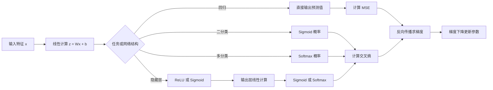
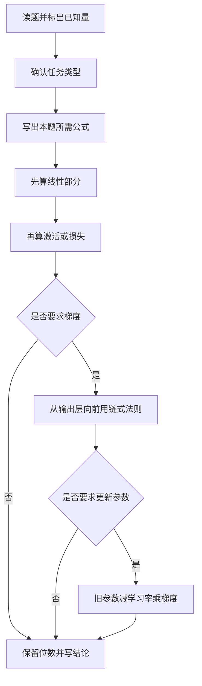
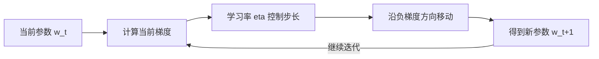
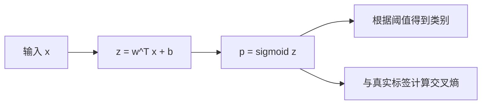
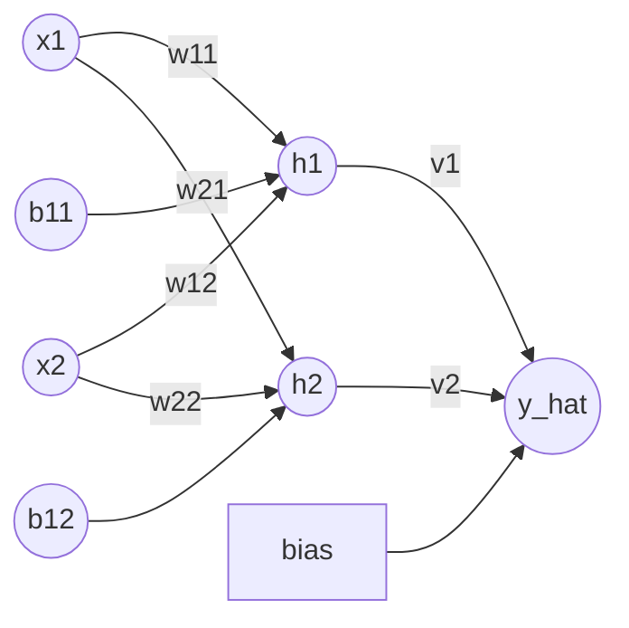
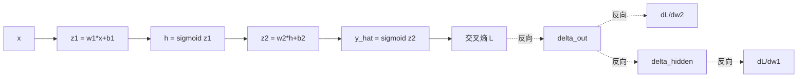
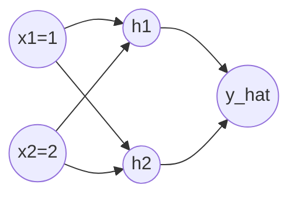

# 机器学习期末计算题扩展精讲版

> 用途：专门攻克期末考试中涉及“代公式、逐步计算、换数字、换结构”的题目。  
> 依据：`机器学习期末章节考场版.md`、各章节笔记以及老师点名的计算重点。  
> 核心原则：不死背某一道例题，而是掌握一套可以迁移到新题目的统一流程。

---

## 0. 先看全局：所有计算模块如何连接



这张图说明：

1. **回归、逻辑回归和神经网络的起点相同**：都先计算 `Wx+b`。
2. 区别主要在于：
   - 输出层使用什么激活函数；
   - 使用什么损失函数。
3. 反向传播负责求梯度，梯度下降负责使用梯度更新参数。

### 0.1 计算题优先级

| 优先级 | 模块 | 必须掌握的计算 |
|---|---|---|
| S | 前向传播 | 矩阵乘法、bias、ReLU、Sigmoid、Softmax |
| S | 反向传播 | 输出误差、链式法则、各层梯度、参数更新 |
| A | 梯度下降 | 求导、代更新式、连续迭代 |
| A | Logistic Regression | `z`、Sigmoid、交叉熵 |
| A | PCA | 中心化、协方差、特征值/特征向量、投影 |
| B | FGSM | 梯度取符号、添加扰动、裁剪 |
| B | Regression | 预测值、MSE、正则化损失 |

### 0.2 本文统一约定

- 向量默认写成列向量。
- `log` 表示自然对数 `ln`。
- Sigmoid 结果通常保留 4 位小数。
- PCA 协方差统一采用课程笔记中的 `1/n`：

  `Sigma = (1/n) * Σ(x_i-mu)(x_i-mu)^T`

- 参数更新统一写成：

  `parameter_new = parameter_old - eta * gradient`

---

# 第一部分：基础工具

## 1. 三个最常用的函数

### 1.1 ReLU

`ReLU(z)=max(0,z)`

| `z` | `ReLU(z)` |
|---:|---:|
| `-3` | `0` |
| `0` | `0` |
| `2.5` | `2.5` |

导数在考试基础题中通常按下面处理：

- `z>0`：`ReLU'(z)=1`
- `z<0`：`ReLU'(z)=0`

在 `z=0` 处，ReLU 数学上不可导。基础考试和多数框架实现中通常约定导数取 `0`；若题目另有说明，以题目为准。

### 1.2 Sigmoid

`sigmoid(z)=1/(1+e^(-z))`

常用近似值：

| `z` | `sigmoid(z)` |
|---:|---:|
| `-2` | `0.1192` |
| `-1.5` | `0.1824` |
| `-1` | `0.2689` |
| `0` | `0.5000` |
| `0.5` | `0.6225` |
| `1` | `0.7311` |
| `2` | `0.8808` |

导数：

`sigmoid'(z)=sigmoid(z)(1-sigmoid(z))`

若已经知道 `h=sigmoid(z)`，可直接写：

`sigmoid'(z)=h(1-h)`

### 1.3 Softmax

多分类输出：

`p_i=e^(z_i)/Σ_j e^(z_j)`

性质：

- 每个 `p_i` 都在 `(0,1)`；
- 所有类别概率之和为 `1`；
- 最大的 `z_i` 对应最大的类别概率。

---

## 2. 通用解题检查清单



每做完一道题，检查四件事：

1. 矩阵维度是否能相乘；
2. bias 是否漏加；
3. 激活函数是否漏算；
4. 参数更新是否使用了减号。

---

# 第二部分：Regression 与 MSE

## 3. 回归的统一模型

线性回归：

`y_hat=w^T x+b`

均方误差：

`MSE=(1/n)Σ(y_hat_i-y_i)^2`

加入 L2 正则化：

`Loss=MSE+lambda*||w||^2`

## 4. 固定解题模板

1. 计算每个样本的预测值 `y_hat`；
2. 计算误差 `y_hat-y`；
3. 误差平方；
4. 求平均得到 MSE；
5. 若有正则化，再计算 `lambda*||w||^2`。

## 5. 例题组

### 例题 5.1：单样本预测

已知：

- `x=[2,3]^T`
- `w=[1.5,-0.5]^T`
- `b=1`

求预测值。

**解：**

`y_hat=w^T x+b`

`=1.5*2+(-0.5)*3+1`

`=3-1.5+1=2.5`

**答案：** `y_hat=2.5`

### 例题 5.2：多样本 MSE

三个样本的真实值和预测值分别为：

- `y=[3,5,4]`
- `y_hat=[2,7,4]`

求 MSE。

**解：**

1. 误差：`[-1,2,0]`
2. 平方误差：`[1,4,0]`
3. `MSE=(1+4+0)/3=5/3≈1.6667`

**答案：** `MSE≈1.6667`

### 例题 5.3：MSE 加 L2 正则化

沿用例题 5.2，设：

- `w=[1,-2]^T`
- `lambda=0.1`

求总损失。

**解：**

`||w||^2=1^2+(-2)^2=5`

正则项：

`lambda*||w||^2=0.1*5=0.5`

总损失：

`Loss=1.6667+0.5=2.1667`

**答案：** `Loss≈2.1667`

### 例题 5.4：反向判断题

某模型加入更强正则化后：

- 训练误差从 `0.2` 上升到 `0.5`；
- 测试误差从 `1.4` 下降到 `0.8`。

说明了什么？

**答案：**

- 原模型存在过拟合，variance 较大；
- 正则化限制了参数，使模型不再过度拟合训练数据；
- 训练误差略升，但泛化能力变好。

### 例题 5.5：线性回归的一次参数更新

为简化单样本计算，令损失为：

`L=(1/2)(y_hat-y)^2`

已知：

- `x=2`
- `y=5`
- `w=1`
- `b=0`
- `eta=0.1`

求一次更新后的 `w` 和 `b`。

**解：**

预测：

`y_hat=wx+b=1*2+0=2`

误差：

`y_hat-y=2-5=-3`

梯度：

`dL/dw=(y_hat-y)x=(-3)*2=-6`

`dL/db=y_hat-y=-3`

更新：

`w_new=1-0.1*(-6)=1.6`

`b_new=0-0.1*(-3)=0.3`

**答案：** `w_new=1.6`，`b_new=0.3`

这里使用 `1/2` 是为了让平方项求导后的 `2` 被约掉。若题目使用普通平方误差或 MSE，应严格按照题目定义求导。

---

# 第三部分：Gradient Descent

## 6. 梯度下降到底在算什么

目标：不断调整参数，使损失函数变小。

`w_(t+1)=w_t-eta*(dL/dw_t)`



## 7. 固定解题模板

1. 对 `L(w)` 求导；
2. 写完整更新式；
3. 将 `w0` 代入得到 `w1`；
4. 将 `w1` 代入得到 `w2`；
5. 重复到题目指定轮数。

> 不要一步直接跳到最终答案。过程分通常就在每轮代入中。

## 8. 例题组

### 例题 8.1：课程标准题

`L(w)=w^2+5w+6`，`eta=0.1`，`w0=2`，求 `w3`。

**解：**

`dL/dw=2w+5`

`w_new=w_old-0.1(2w_old+5)`

- `w1=2-0.1*(9)=1.1`
- `w2=1.1-0.1*(7.2)=0.38`
- `w3=0.38-0.1*(5.76)=-0.196`

**答案：** `w3=-0.196`

### 例题 8.2：换成平方距离形式

`L(w)=(w-3)^2`，`eta=0.2`，`w0=0`，求两轮更新后的 `w2`。

**解：**

`dL/dw=2(w-3)`

更新式：

`w_new=w_old-0.2*2(w_old-3)`

第一轮：

`w1=0-0.4*(0-3)=1.2`

第二轮：

`w2=1.2-0.4*(1.2-3)=1.92`

**答案：** `w2=1.92`

这里最优点是 `w=3`。可以看到参数从 `0` 向 `3` 靠近。

### 例题 8.3：梯度为负时往哪走

已知当前：

- `w=1`
- `dL/dw=-4`
- `eta=0.1`

求更新后的 `w`。

**解：**

`w_new=1-0.1*(-4)=1.4`

**答案：** `w_new=1.4`

易错点：梯度为负时，减去负数，所以参数会增大。

### 例题 8.4：两个参数同时更新

已知损失：

`L(w,b)=(w-2)^2+(b+1)^2`

初始值：

- `w0=0`
- `b0=1`
- `eta=0.25`

求一次更新后的参数。

**解：**

分别求偏导：

`dL/dw=2(w-2)`

`dL/db=2(b+1)`

在 `(w0,b0)=(0,1)` 处：

- `dL/dw=2*(0-2)=-4`
- `dL/db=2*(1+1)=4`

更新：

- `w1=0-0.25*(-4)=1`
- `b1=1-0.25*(4)=0`

**答案：** `(w1,b1)=(1,0)`

### 例题 8.5：比较不同学习率

仍令 `L(w)=(w-3)^2`，从 `w0=0` 出发。

#### 情况 A：`eta=0.1`

`w1=0-0.1*(-6)=0.6`

参数缓慢接近 `3`。

#### 情况 B：`eta=0.5`

`w1=0-0.5*(-6)=3`

一步到达最优点。

#### 情况 C：`eta=1.1`

`w1=0-1.1*(-6)=6.6`

已经越过 `3`，后续可能来回震荡甚至发散。

**结论：**

- 学习率小：通常稳定，但慢；
- 学习率合适：快速接近最优点；
- 学习率过大：越过最优点，可能震荡。

### 例题 8.6：Mini-batch 梯度平均

某个 mini-batch 有两个样本，它们对参数 `w` 产生的梯度分别为：

- `g1=2`
- `g2=-0.5`

当前 `w=1`，学习率 `eta=0.2`。使用平均梯度更新一次。

**解：**

平均梯度：

`g=(g1+g2)/2=(2-0.5)/2=0.75`

更新：

`w_new=1-0.2*0.75=0.85`

**答案：** `w_new=0.85`

- 每次只使用一个样本：SGD；
- 每次使用一小批样本并取平均：mini-batch；
- 每次使用全部训练样本：full-batch。

### 例题 8.7：Loss 上升是否一定说明训练失败

某次训练记录为：

`[1.00,0.82,0.86,0.70,0.65]`

第 3 次记录比第 2 次高，是否说明梯度下降一定失败？

**答案：** 不一定。

- SGD 和 mini-batch 的梯度带有随机性；
- 学习率较大时也可能短暂越过较优位置；
- 非凸损失面上的训练通常不会严格逐轮下降；
- 应观察整体趋势，而不是要求每一步都下降。

---

# 第四部分：Logistic Regression、交叉熵与 Softmax

## 9. 二分类统一计算链



公式：

`z=w^T x+b`

`p=sigmoid(z)=1/(1+e^(-z))`

`L=-[y log p+(1-y)log(1-p)]`

## 10. 交叉熵的快速分情况写法

### 若 `y=1`

`L=-log(p)`

模型给正类概率越低，损失越大。

### 若 `y=0`

`L=-log(1-p)`

模型给正类概率越高，损失越大。

## 11. 例题组

### 例题 11.1：标签为 1

已知：

- `x=[1,2]^T`
- `w=[0.5,-1]^T`
- `b=0`
- `y=1`

求 `z`、`p`、交叉熵损失。

**解：**

`z=0.5*1+(-1)*2=-1.5`

`p=sigmoid(-1.5)≈0.1824`

因为 `y=1`：

`L=-log(0.1824)≈1.701`

**答案：** `p≈0.1824`，`L≈1.701`

### 例题 11.2：标签为 0

设某模型输出 `p=0.8`，真实标签 `y=0`，求损失。

**解：**

`L=-log(1-p)`

`=-log(0.2)≈1.609`

**答案：** `L≈1.609`

解释：真实是负类，但模型给了 `80%` 的正类概率，因此惩罚较大。

### 例题 11.3：同一个概率，不同标签

模型输出 `p=0.9`。

#### 若 `y=1`

`L=-log(0.9)≈0.105`

#### 若 `y=0`

`L=-log(0.1)≈2.303`

**结论：** 相同预测概率是否“好”，取决于真实标签。

### 例题 11.4：两样本平均交叉熵

两个样本：

- 样本 1：`y1=1`，`p1=0.8`
- 样本 2：`y2=0`，`p2=0.3`

求平均损失。

**解：**

样本 1：

`L1=-log(0.8)≈0.2231`

样本 2：

`L2=-log(1-0.3)=-log(0.7)≈0.3567`

平均：

`L=(0.2231+0.3567)/2≈0.2899`

**答案：** 平均交叉熵约为 `0.2899`

### 例题 11.5：Softmax 三分类

某三分类模型输出分数：

`z=[2,1,0]`

求 Softmax 概率。

**解：**

先计算指数：

- `e^2≈7.389`
- `e^1≈2.718`
- `e^0=1`

总和：

`S=7.389+2.718+1=11.107`

因此：

- `p1=7.389/11.107≈0.6652`
- `p2=2.718/11.107≈0.2447`
- `p3=1/11.107≈0.0900`

检查：

`0.6652+0.2447+0.0900≈1`

**答案：** `p≈[0.6652,0.2447,0.0900]`，预测为第 1 类。

### 例题 11.6：Softmax 交叉熵

沿用例题 11.5，若真实类别是第 2 类，求交叉熵。

多分类单样本交叉熵只看真实类别对应的概率：

`L=-log(p_true)`

所以：

`L=-log(0.2447)≈1.408`

**答案：** `L≈1.408`

### 例题 11.7：逻辑回归的一次参数更新

已知：

- `x=[1,2]^T`
- `w=[0,0]^T`
- `b=0`
- `y=1`
- `eta=0.1`

求一次梯度下降后的参数。

**解：**

`z=w^T x+b=0`

`p=sigmoid(0)=0.5`

Sigmoid 配合二分类交叉熵时：

`delta=p-y=0.5-1=-0.5`

梯度：

`dL/dw=delta*x=[-0.5,-1]^T`

`dL/db=delta=-0.5`

更新：

`w_new=[0,0]^T-0.1[-0.5,-1]^T=[0.05,0.1]^T`

`b_new=0-0.1*(-0.5)=0.05`

**答案：** `w_new=[0.05,0.1]^T`，`b_new=0.05`

### 例题 11.8：Softmax 平移不变性与稳定计算

比较：

- `z=[2,1,0]`
- `z'=[102,101,100]`

第二组只是给每个分数都加了 `100`，Softmax 概率完全相同。

计算很大的指数容易溢出，因此实际常先减去最大值：

`softmax(z_i)=e^(z_i-max(z))/Σ_j e^(z_j-max(z))`

例如：

`[102,101,100]-102=[0,-1,-2]`

再计算指数更稳定，最终概率仍约为：

`[0.6652,0.2447,0.0900]`

---

# 第五部分：神经网络前向传播

## 12. 看懂神经网络图

下面是一张两输入、两隐藏神经元、单输出的网络：



对应矩阵形式：

`z1=W1*x+b1`

`a1=f(z1)`

`z2=W2*a1+b2`

`y_hat=g(z2)`

## 13. 固定解题模板

### 隐藏层

1. `z1=W1*x+b1`
2. `a1=f(z1)`

### 输出层

3. `z2=W2*a1+b2`
4. `y_hat=g(z2)`

> 一定把 `z` 和 `a` 分开。  
> `z` 是激活前，`a` 是激活后。

## 14. 例题组

### 例题 14.1：单神经元 ReLU

已知：

- `x=[2,-1]^T`
- `w=[1,3]^T`
- `b=0.5`
- 激活函数为 ReLU

求输出。

**解：**

`z=1*2+3*(-1)+0.5=-0.5`

`a=ReLU(-0.5)=0`

**答案：** `a=0`

### 例题 14.2：单神经元 Sigmoid

沿用例题 14.1，但激活函数改为 Sigmoid。

`a=sigmoid(-0.5)≈0.3775`

**答案：** `a≈0.3775`

这说明：同一个线性输出，经过不同激活函数会得到不同结果。

### 例题 14.3：课程标准两层网络

输入：

`x=[1,2]^T`

隐藏层：

- `W1=[[1,0],[-1,1]]`
- `b1=[0,1]^T`
- 激活函数 ReLU

输出层：

- `W2=[0.5,-1]`
- `b2=0`
- 激活函数 Sigmoid

**解：**

第一步，隐藏层线性计算：

`z1=W1*x+b1`

第一个神经元：

`z1_1=1*1+0*2+0=1`

第二个神经元：

`z1_2=(-1)*1+1*2+1=2`

所以：

`z1=[1,2]^T`

第二步，过 ReLU：

`a1=[1,2]^T`

第三步，输出层线性计算：

`z2=0.5*1+(-1)*2+0=-1.5`

第四步，过 Sigmoid：

`y_hat=sigmoid(-1.5)≈0.1824`

**答案：** `y_hat≈0.1824`

### 例题 14.4：ReLU 会关闭部分神经元

输入：

`x=[1,-2]^T`

隐藏层：

- `W1=[[1,1],[-1,2]]`
- `b1=[0,1]^T`
- ReLU

输出层：

- `W2=[2,-1]`
- `b2=0.5`
- Sigmoid

**解：**

隐藏层：

- `z1_1=1*1+1*(-2)+0=-1`
- `z1_2=(-1)*1+2*(-2)+1=-4`

经过 ReLU：

`a1=[0,0]^T`

输出层：

`z2=2*0+(-1)*0+0.5=0.5`

`y_hat=sigmoid(0.5)≈0.6225`

**答案：** `y_hat≈0.6225`

易错点：隐藏层虽然全部输出 0，但输出层还有 bias，所以最终输出不一定为 0。

### 例题 14.5：多分类神经网络输出

某网络隐藏层输出：

`h=[1,2]^T`

输出层：

`W=[[1,0],[0,1],[-1,1]]`

`b=[0,0,0]^T`

求三个类别的 Softmax 概率。

**解：**

先计算 logits：

`z=W*h+b=[1,2,1]^T`

指数：

- `e^1≈2.718`
- `e^2≈7.389`
- `e^1≈2.718`

总和：

`S≈12.825`

概率：

- `p1≈2.718/12.825≈0.2119`
- `p2≈7.389/12.825≈0.5761`
- `p3≈2.718/12.825≈0.2119`

**答案：** `p≈[0.2119,0.5761,0.2119]`，预测第 2 类。

---

# 第六部分：Backpropagation

## 15. 前向传播与反向传播的统一视角



### 15.1 输出层常用结论

当输出层为 Sigmoid，损失为二分类交叉熵时：

`delta_out=y_hat-y`

于是：

`dL/dw2=delta_out*h`

`dL/db2=delta_out`

### 15.2 隐藏层为 Sigmoid

`delta_hidden=delta_out*w2*h(1-h)`

`dL/dw1=delta_hidden*x`

`dL/db1=delta_hidden`

## 16. 固定解题模板

1. 完整前向传播；
2. 算 `delta_out=y_hat-y`；
3. 算输出层参数梯度；
4. 将误差乘以后层权重传回；
5. 再乘隐藏层激活函数导数；
6. 算隐藏层参数梯度；
7. 若题目要求，更新全部参数。

## 17. 例题组

### 例题 17.1：完整单隐藏神经元反向传播

网络参数：

- `x=1`
- `y=1`
- `w1=0.5`
- `b1=0`
- `w2=1`
- `b2=0`
- 两层均用 Sigmoid
- 损失为二分类交叉熵

#### 第一步：前向传播

隐藏层：

`z1=w1*x+b1=0.5`

`h=sigmoid(0.5)≈0.6225`

输出层：

`z2=w2*h+b2=0.6225`

`y_hat=sigmoid(0.6225)≈0.6508`

#### 第二步：输出层误差

`delta_out=y_hat-y`

`=0.6508-1=-0.3492`

#### 第三步：输出层梯度

`dL/dw2=delta_out*h`

`≈(-0.3492)*0.6225≈-0.2174`

`dL/db2=delta_out≈-0.3492`

#### 第四步：隐藏层误差

Sigmoid 导数：

`h(1-h)=0.6225*(1-0.6225)≈0.2350`

`delta_hidden=delta_out*w2*h(1-h)`

`≈(-0.3492)*1*0.2350≈-0.0821`

#### 第五步：隐藏层梯度

`dL/dw1=delta_hidden*x≈-0.0821`

`dL/db1=delta_hidden≈-0.0821`

**最终答案：**

- `dL/dw2≈-0.2174`
- `dL/db2≈-0.3492`
- `dL/dw1≈-0.0821`
- `dL/db1≈-0.0821`

### 例题 17.2：继续更新参数

沿用例题 17.1，学习率 `eta=0.1`，求更新后的参数。

**解：**

`w2_new=1-0.1*(-0.2174)=1.02174`

`b2_new=0-0.1*(-0.3492)=0.03492`

`w1_new=0.5-0.1*(-0.0821)=0.50821`

`b1_new=0-0.1*(-0.0821)=0.00821`

**答案：**

- `w1_new≈0.50821`
- `b1_new≈0.00821`
- `w2_new≈1.02174`
- `b2_new≈0.03492`

因为真实标签为 `1`，本轮更新总体上会推动网络输出更接近 `1`。

### 例题 17.3：真实标签改为 0

保持例题 17.1 的网络与前向输出 `y_hat≈0.6508`，只把真实标签改成 `y=0`。

输出误差：

`delta_out=y_hat-y=0.6508`

输出层梯度：

`dL/dw2=0.6508*0.6225≈0.4051`

`dL/db2=0.6508`

隐藏层误差：

`delta_hidden=0.6508*1*0.2350≈0.1529`

隐藏层梯度：

`dL/dw1=0.1529*1≈0.1529`

**观察：**

- 当 `y=1` 时，梯度为负，更新后部分参数增大；
- 当 `y=0` 时，梯度为正，更新后参数减小；
- 方向改变是因为模型需要把输出从 `0.6508` 向不同目标推近。

### 例题 17.4：ReLU 隐藏层的梯度

设：

- 输入 `x=2`
- 隐藏层 `z1=w1*x+b1`
- `w1=-1`，`b1=0`
- 隐藏层使用 ReLU

则：

`z1=-1*2=-2`

`h=ReLU(-2)=0`

由于 `z1<0`：

`ReLU'(z1)=0`

无论后面传回来的误差是多少：

`delta_hidden=(后层误差)*(后层权重)*0=0`

因此：

`dL/dw1=0`

**结论：** 该神经元在当前样本下梯度为 0，不会通过这个样本得到更新。只有当它对几乎所有输入都长期处于负区间、持续无法更新时，才称为“死亡 ReLU”。

### 例题 17.5：两个隐藏神经元的输出层梯度

已知：

- 隐藏层输出 `h=[0.4,0.7]^T`
- 输出层权重 `v=[0.5,-1]^T`
- 输出层 bias `b=0`
- 输出层为 Sigmoid
- 真实标签 `y=1`

求输出层权重梯度。

**解：**

先前向：

`z=v^T h+b=0.5*0.4+(-1)*0.7=-0.5`

`y_hat=sigmoid(-0.5)≈0.3775`

输出误差：

`delta_out=0.3775-1=-0.6225`

对每个输出层权重：

`dL/dv=delta_out*h`

所以：

- `dL/dv1=-0.6225*0.4=-0.2490`
- `dL/dv2=-0.6225*0.7=-0.4358`

`dL/db=-0.6225`

**答案：**

`dL/dv≈[-0.2490,-0.4358]^T`

### 例题 17.6：两输入、两隐藏神经元的完整矩阵反向传播

这是应对“换结构题”最重要的一题。

已知：

- `x=[1,2]^T`
- `y=1`
- `W1=[[1,0],[0,1]]`
- `b1=[0,0]^T`
- 隐藏层使用 Sigmoid
- `W2=[0.5,-0.5]`
- `b2=0`
- 输出层使用 Sigmoid
- 损失使用二分类交叉熵
- 学习率 `eta=0.1`

网络形状：



#### 第一步：前向传播

`z1=W1*x+b1=[1,2]^T`

逐元素过 Sigmoid：

`a1=[sigmoid(1),sigmoid(2)]^T`

`≈[0.7311,0.8808]^T`

输出层：

`z2=W2*a1+b2`

`=0.5*0.7311-0.5*0.8808≈-0.0749`

`y_hat=sigmoid(-0.0749)≈0.4813`

#### 第二步：输出层误差和梯度

`delta2=y_hat-y≈0.4813-1=-0.5187`

矩阵形式：

`dW2=delta2*a1^T`

所以：

`dW2≈[-0.3792,-0.4569]`

`db2=delta2≈-0.5187`

#### 第三步：隐藏层误差

矩阵公式：

`delta1=(W2^T*delta2) ⊙ [a1 ⊙ (1-a1)]`

先把输出误差传回两个隐藏神经元：

`W2^T*delta2≈[-0.2594,0.2594]^T`

隐藏层 Sigmoid 导数：

`a1 ⊙ (1-a1)≈[0.1966,0.1050]^T`

逐元素相乘：

`delta1≈[-0.0510,0.0272]^T`

#### 第四步：隐藏层梯度

`dW1=delta1*x^T`

所以：

`dW1≈[[-0.0510,-0.1020],[0.0272,0.0544]]`

`db1=delta1≈[-0.0510,0.0272]^T`

#### 第五步：更新参数

`W2_new=W2-eta*dW2`

`≈[0.5379,-0.4543]`

`b2_new=0-0.1*(-0.5187)≈0.0519`

`W1_new=W1-eta*dW1`

`≈[[1.0051,0.0102],[-0.0027,0.9946]]`

`b1_new=b1-eta*db1`

`≈[0.0051,-0.0027]^T`

**最终梯度：**

- `dW2≈[-0.3792,-0.4569]`
- `db2≈-0.5187`
- `dW1≈[[-0.0510,-0.1020],[0.0272,0.0544]]`
- `db1≈[-0.0510,0.0272]^T`

### 例题 17.7：ReLU 两隐藏神经元的完整反向传播

已知：

- `x=[1,2]^T`
- `W1=[[1,0],[-1,0]]`
- `b1=[0,0]^T`
- 隐藏层使用 ReLU
- `W2=[0.5,-1]`
- `b2=0`
- 输出层使用 Sigmoid
- `y=1`

#### 前向传播

`z1=W1*x=[1,-1]^T`

`a1=ReLU(z1)=[1,0]^T`

`z2=W2*a1=0.5`

`y_hat=sigmoid(0.5)≈0.6225`

#### 输出层梯度

`delta2=y_hat-y≈-0.3775`

`dW2=delta2*a1^T≈[-0.3775,0]`

`db2≈-0.3775`

#### 隐藏层梯度

ReLU 导数：

`ReLU'(z1)=[1,0]^T`

`delta1=(W2^T*delta2) ⊙ ReLU'(z1)`

`=[-0.1888,0.3775]^T ⊙ [1,0]^T`

`=[-0.1888,0]^T`

`dW1=delta1*x^T`

`≈[[-0.1888,-0.3775],[0,0]]`

`db1≈[-0.1888,0]^T`

**结论：**

- 第一个隐藏神经元处于 ReLU 正区间，能够接收梯度；
- 第二个隐藏神经元处于负区间，本轮梯度为 0；
- 与第二个隐藏神经元直接相关的 `W1` 第二行和 `b1` 第二项本轮不更新；
- `W2` 的第二项梯度也为 0，因为该神经元的激活输出为 0。

### 17.8 为什么梯度会消失

假设梯度反向通过 4 层，每层都乘一个约为 `0.2` 的激活导数：

`0.2^4=0.0016`

原本大小为 `1` 的梯度传到前面只剩 `0.0016`。

这不是复杂推导，而是理解：

> 许多小于 1 的数连续相乘，结果会快速接近 0。

---

# 第七部分：FGSM

## 18. FGSM 的计算本质

`x_adv=x+epsilon*sign(grad_x L)`


注意：

- FGSM 的目的是**增大损失**；
- 它修改的是输入 `x`；
- `sign` 只输出 `-1、0、1`。

## 19. 例题组

### 例题 19.1：标准 FGSM

已知：

- `x=[0.4,0.6,0.2]`
- `epsilon=0.1`
- `grad_x L=[0.2,-1.5,0]`

求对抗样本。

**解：**

`sign(grad_x L)=[1,-1,0]`

扰动：

`epsilon*sign(grad_x L)=[0.1,-0.1,0]`

所以：

`x_adv=[0.5,0.5,0.2]`

### 例题 19.2：所有维度的梯度大小不同

已知：

- `x=[0.2,0.4,0.8]`
- `epsilon=0.05`
- `grad_x L=[100,-0.001,2]`

求 `x_adv`。

虽然梯度大小差异很大，但 FGSM 只取符号：

`sign(grad_x L)=[1,-1,1]`

所以：

`x_adv=[0.25,0.35,0.85]`

**易错点：** 不是直接计算 `x+epsilon*grad`。

### 例题 19.3：加入合法范围裁剪

像素值要求在 `[0,1]`，已知：

- `x=[0.98,0.03,0.5]`
- `epsilon=0.1`
- 梯度符号为 `[1,-1,1]`

直接相加：

`[1.08,-0.07,0.6]`

裁剪到 `[0,1]`：

`x_adv=[1,0,0.6]`

### 例题 19.4：`L_infinity` 扰动大小

若：

`x_adv-x=[0.05,-0.1,0.02]`

则：

`||x_adv-x||_infinity=max(0.05,0.1,0.02)=0.1`

它表示所有维度中，最大的单维改动是 `0.1`。

---

# 第八部分：PCA

## 20. PCA 的完整路线


PCA 的核心：

> 最大特征值对应的特征向量，就是方差最大的方向。

## 21. 固定解题模板

1. 求每一维均值；
2. 原始样本减均值；
3. 计算协方差矩阵；
4. 求特征值；
5. 找最大特征值对应的特征向量；
6. 单位化；
7. 用 `z=w^T(x-mu)` 投影。

## 22. 例题组

### 例题 22.1：已知协方差矩阵判断主成分

`Sigma=[[9,0],[0,1]]`

因为矩阵已经是对角矩阵：

- 特征值为 `9` 和 `1`；
- 最大特征值为 `9`；
- 对应特征向量为 `[1,0]^T`。

**答案：** 第一主成分是 `x1` 方向。

### 例题 22.2：已知主成分求投影

第一主成分：

`w=[1,0]^T`

中心化样本：

`x=[3,1]^T`

投影：

`z=w^T x=[1,0][3,1]^T=3`

**答案：** `z=3`

### 例题 22.3：从原始数据完整计算 PCA

给定三个二维样本：

`x1=[1,1]^T`

`x2=[2,2]^T`

`x3=[3,3]^T`

求第一主成分。

#### 第一步：计算均值

`mu=[(1+2+3)/3,(1+2+3)/3]^T=[2,2]^T`

#### 第二步：中心化

- `x1-mu=[-1,-1]^T`
- `x2-mu=[0,0]^T`
- `x3-mu=[1,1]^T`

#### 第三步：协方差矩阵

`Sigma=(1/3) * ([-1,-1]^T[-1,-1] + [0,0]^T[0,0] + [1,1]^T[1,1])`

两个非零外积都为：

`[[1,1],[1,1]]`

所以：

`Sigma=(1/3)[[2,2],[2,2]]`

`=[[2/3,2/3],[2/3,2/3]]`

#### 第四步：特征值与特征向量

这个矩阵的特征值为：

- `lambda1=4/3`
- `lambda2=0`

最大特征值 `4/3` 对应方向：

`[1,1]^T`

单位化后：

`w1=(1/sqrt(2))[1,1]^T`

**答案：** 第一主成分方向是沿着直线 `x2=x1` 的方向。

#### 第五步：投影

三个中心化样本的投影：

- `z1=w1^T[-1,-1]^T=-sqrt(2)`
- `z2=0`
- `z3=sqrt(2)`

原来的二维点被表示成了一个一维坐标。

### 例题 22.4：非对角协方差矩阵

给定：

`Sigma=[[2,1],[1,2]]`

求第一主成分方向。

特征方程：

`|Sigma-lambda I|=0`

`|(2-lambda),1;1,(2-lambda)|=0`

`(2-lambda)^2-1=0`

得到：

- `lambda1=3`
- `lambda2=1`

最大特征值为 `3`。

代入：

`(Sigma-3I)w=0`

得到 `w1=w2`，所以方向可取：

`[1,1]^T`

单位化：

`w=(1/sqrt(2))[1,1]^T`

**答案：** 第一主成分方向为 `(1/sqrt(2))[1,1]^T`。

### 例题 22.5：解释方差保留率

假设三个特征值为：

`lambda=[5,3,2]`

只保留前两个主成分，方差保留率为：

`(5+3)/(5+3+2)=8/10=80%`

**答案：** 保留前两个主成分可保留 `80%` 的总方差。

### 例题 22.6：至少保留多少个主成分

特征值从大到小为：

`[6,3,1]`

要求累计方差保留率至少达到 `85%`，最少保留几个主成分？

总方差：

`6+3+1=10`

只保留第一个：

`6/10=60%`

保留前两个：

`(6+3)/10=90%`

**答案：** 最少保留 `2` 个主成分。

### 22.7 PCA 三个易错结论

1. `w` 与 `-w` 表示同一条主成分轴，只是坐标正方向相反。
2. 如果最大特征值重复，第一主成分方向可能不唯一。
3. PCA 能让不同主成分正交、投影后去相关，但“去相关”不等于“统计独立”。

---

# 第九部分：统一综合题

## 23. 综合题一：从前向传播到损失

给定网络：

- `x=[1,-1]^T`
- `W1=[[1,2],[-1,1]]`
- `b1=[0,1]^T`
- 隐藏层使用 ReLU
- `W2=[1,-2]`
- `b2=0`
- 输出层使用 Sigmoid
- 真实标签 `y=1`

求：

1. 隐藏层激活；
2. 最终概率；
3. 交叉熵损失。

**解：**

隐藏层线性输出：

- `z1_1=1*1+2*(-1)+0=-1`
- `z1_2=(-1)*1+1*(-1)+1=-1`

ReLU：

`h=[0,0]^T`

输出层：

`z2=1*0+(-2)*0+0=0`

`y_hat=sigmoid(0)=0.5`

真实标签为 `1`：

`L=-log(0.5)≈0.6931`

**答案：**

- `h=[0,0]^T`
- `y_hat=0.5`
- `L≈0.6931`

## 24. 综合题二：从前向传播到参数更新

给定单隐藏神经元网络：

- `x=2`
- `y=1`
- `w1=0.5`
- `b1=0`
- `w2=-1`
- `b2=0`
- 隐藏层与输出层均使用 Sigmoid
- 学习率 `eta=0.1`

求全部梯度并完成一次参数更新。

### 第一步：前向传播

`z1=0.5*2=1`

`h=sigmoid(1)≈0.7311`

`z2=(-1)*0.7311=-0.7311`

`y_hat=sigmoid(-0.7311)≈0.3250`

### 第二步：输出误差

`delta_out=0.3250-1=-0.6750`

### 第三步：输出层梯度

`dL/dw2=delta_out*h`

`≈-0.6750*0.7311≈-0.4935`

`dL/db2=-0.6750`

### 第四步：隐藏层误差

`h(1-h)=0.7311*0.2689≈0.1966`

`delta_hidden=delta_out*w2*h(1-h)`

`≈(-0.6750)*(-1)*0.1966≈0.1327`

### 第五步：隐藏层梯度

`dL/dw1=delta_hidden*x≈0.1327*2=0.2654`

`dL/db1≈0.1327`

### 第六步：更新参数

`w2_new=-1-0.1*(-0.4935)=-0.95065`

`b2_new=0-0.1*(-0.6750)=0.06750`

`w1_new=0.5-0.1*(0.2654)=0.47346`

`b1_new=0-0.1*(0.1327)=-0.01327`

**最终答案：**

- `w1_new≈0.47346`
- `b1_new≈-0.01327`
- `w2_new≈-0.95065`
- `b2_new≈0.06750`

---

# 第十部分：高频易错点总表

## 25. 公式易错点

| 错误写法/想法 | 正确理解 |
|---|---|
| 梯度就是下降方向 | 梯度是增大最快方向，负梯度才是下降方向 |
| 参数更新用加号 | 最小化损失通常用 `参数-学习率*梯度` |
| Sigmoid 是损失函数 | Sigmoid 是激活函数 |
| Cross Entropy 是激活函数 | Cross Entropy 是损失函数 |
| Logistic Regression 是回归 | 它主要是分类模型 |
| 前向传播先激活再加 bias | 先 `Wx+b`，再激活 |
| 反向传播只算输出层 | 还要通过链式法则传到前面各层 |
| FGSM 直接乘原梯度 | 标准 FGSM 使用梯度的符号 |
| PCA 最大特征值就是主成分 | 最大特征值对应的特征向量才是主成分方向 |
| PCA 投影不用中心化 | 标准 PCA 要先减均值 |

## 26. 数值检查技巧

### Sigmoid

- `z>0`，结果应大于 `0.5`；
- `z<0`，结果应小于 `0.5`；
- `z=0`，结果一定是 `0.5`。

### Softmax

- 所有概率必须大于 0；
- 概率之和必须约等于 1；
- 最大 logit 应对应最大概率。

### 交叉熵

- 正确类别概率越高，损失越小；
- 概率接近 1，损失接近 0；
- 概率接近 0，损失非常大。

### PCA

- 协方差矩阵应当对称；
- 主成分向量通常要单位化；
- 最大特征值对应第一主成分。

---

# 第十一部分：自测题

> 建议先遮住答案独立完成。

## 27. 基础自测

### 题 1：MSE

`y=[1,3]`，`y_hat=[2,5]`，求 MSE。

### 题 2：梯度下降

`L(w)=(w+2)^2`，`eta=0.25`，`w0=2`，求 `w2`。

### 题 3：Sigmoid 与交叉熵

`z=1`，`y=0`，求 `p` 和损失。

### 题 4：Softmax

`z=[0,0,0]`，求三个类别概率。

### 题 5：前向传播

- `x=[1,2]^T`
- `w=[2,-1]^T`
- `b=-1`
- 激活函数 ReLU

求输出。

### 题 6：输出层梯度

已知：

- `h=0.8`
- `y_hat=0.7`
- `y=1`

求 `delta_out` 和 `dL/dw2`。

### 题 7：FGSM

- `x=[0.2,0.5]`
- `epsilon=0.1`
- `grad_x L=[-3,4]`

求 `x_adv`。

### 题 8：PCA

协方差矩阵：

`Sigma=[[4,0],[0,2]]`

求第一主成分方向，以及保留一个主成分时的方差保留率。

### 题 9：完整反向传播

- `x=1`
- `y=0`
- `w1=0`
- `b1=0`
- `w2=2`
- `b2=0`
- 隐藏层和输出层均使用 Sigmoid

求 `dL/dw2` 和 `dL/dw1`。

### 题 10：Mini-batch 更新

三个样本对参数 `w` 的梯度分别为 `[1,-2,4]`，当前 `w=2`，`eta=0.1`。求使用平均梯度更新后的 `w`。

### 题 11：PCA 选择维数

特征值为 `[7,2,1]`。要求保留率至少达到 `90%`，最少保留几个主成分？

## 28. 基础自测答案

### 题 1

平方误差为 `[1,4]`：

`MSE=(1+4)/2=2.5`

### 题 2

`dL/dw=2(w+2)`

`w1=2-0.25*8=0`

`w2=0-0.25*4=-1`

### 题 3

`p=sigmoid(1)≈0.7311`

因为 `y=0`：

`L=-log(1-0.7311)=-log(0.2689)≈1.313`

### 题 4

三个 logit 相同，所以：

`p=[1/3,1/3,1/3]`

### 题 5

`z=2*1+(-1)*2-1=-1`

`ReLU(-1)=0`

### 题 6

`delta_out=0.7-1=-0.3`

`dL/dw2=delta_out*h=-0.3*0.8=-0.24`

### 题 7

`sign(grad_x L)=[-1,1]`

`x_adv=[0.1,0.6]`

### 题 8

- 第一主成分方向：`[1,0]^T`
- 方差保留率：`4/(4+2)=2/3≈66.67%`

### 题 9

前向：

`h=sigmoid(0)=0.5`

`z2=2*0.5=1`

`y_hat=sigmoid(1)≈0.7311`

因为 `y=0`：

`delta_out=0.7311`

`dL/dw2=delta_out*h≈0.7311*0.5=0.3656`

隐藏层误差：

`delta_hidden=0.7311*2*0.5*(1-0.5)≈0.3656`

`dL/dw1=delta_hidden*x≈0.3656`

### 题 10

平均梯度：

`g=(1-2+4)/3=1`

更新：

`w_new=2-0.1*1=1.9`

### 题 11

总方差：

`7+2+1=10`

前两个主成分保留率：

`(7+2)/10=90%`

**答案：** 最少保留 `2` 个主成分。

---

# 第十二部分：考场书写模板

## 29. 梯度下降题

```text
1. 求导：dL/dw = ...
2. 更新式：w_(t+1) = w_t - eta * ...
3. 第 1 轮：w1 = ...
4. 第 2 轮：w2 = ...
5. 所以最终答案为 ...
```

## 30. 前向传播题

```text
1. 隐藏层线性输出：z1 = W1*x+b1
2. 隐藏层激活：a1 = f(z1)
3. 输出层线性输出：z2 = W2*a1+b2
4. 最终输出：y_hat = g(z2)
```

## 31. 反向传播题

下面的 `delta_out=y_hat-y` 简化式，仅适用于“Sigmoid 输出层 + 二分类交叉熵”。如果题目改用 MSE 或其他输出激活函数，需要重新按链式法则求导。

```text
1. 先完成前向传播，求 h 和 y_hat
2. 输出层误差：delta_out = y_hat-y
3. 输出层梯度：dL/dw2 = delta_out*h
4. 隐藏层误差：delta_hidden = delta_out*w2*f'(z1)
5. 隐藏层梯度：dL/dw1 = delta_hidden*x
6. 参数更新：w_new = w_old-eta*gradient
```

## 32. PCA 题

```text
1. 求均值并中心化
2. 计算协方差矩阵
3. 求特征值和特征向量
4. 最大特征值对应第一主成分
5. 单位化并进行投影
```

---

# 33. 最终复习路线

如果时间有限，按下面顺序做题：

1. 例题 14.3：两层网络前向传播；
2. 例题 17.1：完整反向传播；
3. 例题 17.2：参数更新；
4. 例题 8.1、8.2：梯度下降迭代；
5. 例题 11.1、11.5：二分类与多分类；
6. 例题 22.3、22.4：PCA 完整计算；
7. 例题 19.1、19.3：FGSM 与裁剪；
8. 最后完成第十一部分自测题。

真正需要形成肌肉记忆的是：

> 先线性计算，再激活；先前向得到输出，再从损失反向求梯度；最后沿负梯度更新参数。
